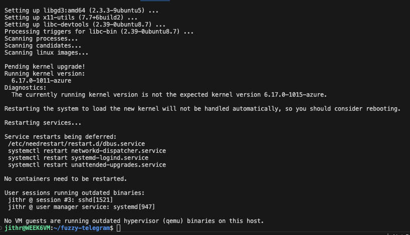

# 01 - Initial Server Setup

## Objective

Prepare the Azure VM for hosting a Ruby on Rails web application.

---

## Updating the Server

The following commands were used to update existing packages and install required dependencies.

sudo apt update
sudo apt upgrade -y 

### Explanation

- apt update refreshes the package lists from Ubuntu repositories.
- apt upgrade -y installs the latest available updates automatically.

---

## Installing Required Packages

sudo apt install curl git build-essential libssl-dev libreadline-dev zlib1g-dev libsqlite3-dev sqlite3 nodejs npm nginx -y 

### Explanation

The following packages were installed:

Package | Purpose
---
| Package | Purpose |
|----------|----------|
| curl | Download files/scripts from the internet |
| git | Version control and GitHub integration |
| build-essential | Required compilation tools |
| nginx | Web server / reverse proxy |
| nodejs + npm | JavaScript runtime required by Rails |
| sqlite3 | Database used for development |

---

## Screenshot
