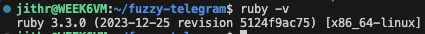
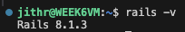
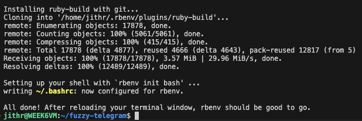
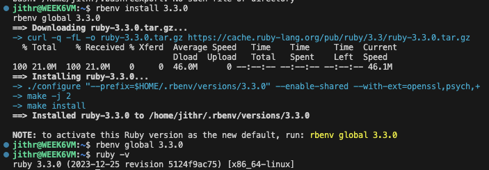

# 02 - Ruby and Ruby on Rails Installation

## Objective

Install Ruby, Ruby on Rails and supporting dependencies required to develop and host a Rails web application on the Ubuntu Azure VM.

---

## Installing Additional Dependencies

The following packages were installed before setting up Ruby.

```bash
sudo apt install libyaml-dev libgmp-dev libffi-dev -y
```

These libraries are required by Ruby gems and Rails components during installation and runtime.

| Package | Purpose |
|---|---|
| libyaml-dev | YAML parsing support |
| libgmp-dev | Mathematical library support |
| libffi-dev | Foreign function interface support |

---

## Installing rbenv

rbenv was used to manage Ruby versions.

```bash
curl -fsSL https://github.com/rbenv/rbenv-installer/raw/main/bin/rbenv-installer | bash
```

rbenv allows Ruby versions to be installed and managed independently without affecting the system-wide environment.

---

## Configuring Shell Environment

The following commands were added to `.bashrc`.

```bash
echo 'export PATH="$HOME/.rbenv/bin:$PATH"' >> ~/.bashrc
echo 'eval "$(rbenv init - bash)"' >> ~/.bashrc
source ~/.bashrc
```

These commands ensure rbenv loads automatically when opening a new terminal session.

---

## Installing Ruby

Ruby version 3.3.0 was installed.

```bash
rbenv install 3.3.0
rbenv global 3.3.0
```

### Verification

```bash
ruby -v
```



---

## Installing Ruby on Rails

Rails was installed using RubyGems.

```bash
gem install rails
```

### Verification

```bash
rails -v
```



---

## Screenshots


