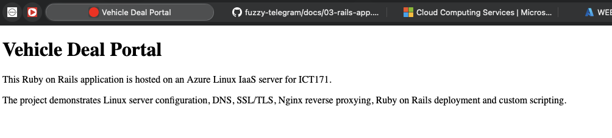
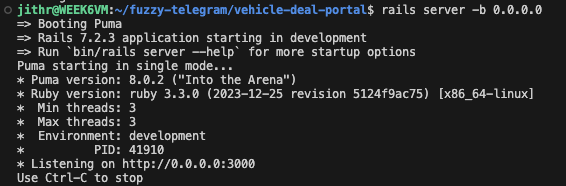

# 03 - Ruby on Rails Application

## Objective

Create and configure the Ruby on Rails application that will be deployed on the Azure Linux VM.

---

## Creating the Rails Application

The following command was used to create a new Rails application:

```bash
rails new vehicle-deal-portal
```

The `rails new` command generates the complete project structure required for a Ruby on Rails application. This includes application folders, configuration files, database settings and development tools.

---

## Running the Rails Development Server

The application was started using:

```bash
cd vehicle-deal-portal
rails server -b 0.0.0.0
```

The `-b 0.0.0.0` option allows the Rails server to listen on all available network interfaces, enabling access from outside the virtual machine.

---

## Generating the Homepage Controller

The following command was used to create the initial controller and view:

```bash
rails generate controller Pages home
```

This command automatically generated:

- Pages controller
- Home view
- Helper files
- Test files
- Route entries

---

## Configuring Application Routing

The routes file was modified:

```bash
nano config/routes.rb
```

The following route was configured:

```ruby
Rails.application.routes.draw do
  root "pages#home"
end
```

This configuration ensures visitors are directed to the Home page when accessing the root URL of the application.

---

## Creating the Homepage

The generated view file was modified:

```bash
nano app/views/pages/home.html.erb
```

The page was updated with project-specific content describing the Vehicle Deal Portal application.

---

## Verification

The Rails application was restarted:

```bash
rails server -b 0.0.0.0
```

The custom homepage loaded successfully when accessed through a web browser.

---

## Screenshot


