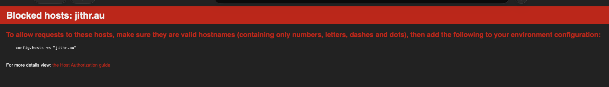
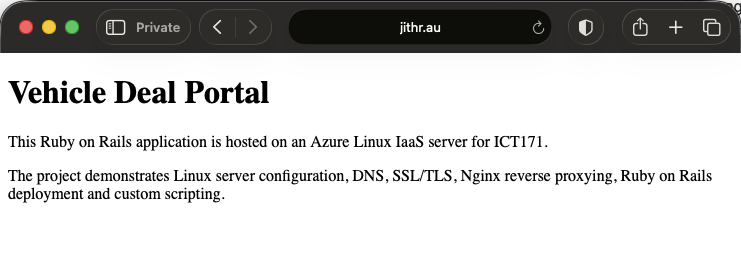
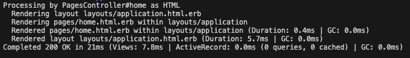

# 04 - Nginx Reverse Proxy Configuration

## Objective

Configure Nginx to serve the Ruby on Rails application through the domain.

---

## Existing Website Setup

Before this step, the domain `jithr.au` was already pointing to the Azure VM and displaying a basic static HTML page from:

```text
/var/www/html
```

The goal of this step was to replace the static HTML website with the Ruby on Rails application.  On a fresh install, you wouldn't need to do this.  Just a step I had to sort out.

---

## Creating a Clean Nginx Configuration

A new Nginx site configuration file was created:

```bash
sudo nano /etc/nginx/sites-available/jithr
```

The following configuration was used:

```nginx
server {
    listen 80;
    listen [::]:80;
    server_name jithr.au www.jithr.au;

    return 301 https://$host$request_uri;
}

server {
    listen 443 ssl;
    listen [::]:443 ssl;
    server_name jithr.au www.jithr.au;

    ssl_certificate /etc/letsencrypt/live/jithr.au/fullchain.pem;
    ssl_certificate_key /etc/letsencrypt/live/jithr.au/privkey.pem;
    include /etc/letsencrypt/options-ssl-nginx.conf;
    ssl_dhparam /etc/letsencrypt/ssl-dhparams.pem;

    location / {
        proxy_pass http://127.0.0.1:3000;
        proxy_http_version 1.1;

        proxy_set_header Host $host;
        proxy_set_header X-Forwarded-For $proxy_add_x_forwarded_for;
        proxy_set_header X-Forwarded-Proto $scheme;
    }
}
```

This configuration performs two main tasks:

| Configuration | Purpose |
|---|---|
| `listen 80` | Accepts normal HTTP traffic |
| `return 301 https://$host$request_uri` | Redirects HTTP traffic to HTTPS |
| `listen 443 ssl` | Accepts HTTPS traffic |
| `server_name jithr.au www.jithr.au` | Links the configuration to the domain |
| `proxy_pass http://127.0.0.1:3000` | Sends web requests from Nginx to the Rails app |
| SSL certificate lines | Use the existing Let's Encrypt certificate |

---

## Enabling the New Nginx Site

The old default site was removed from the enabled sites folder:

```bash
sudo rm /etc/nginx/sites-enabled/default
```

The new site configuration was enabled using a symbolic link:

```bash
sudo ln -sf /etc/nginx/sites-available/jithr /etc/nginx/sites-enabled/jithr
```

---

## Testing Nginx Configuration

The Nginx configuration was tested using:

```bash
sudo nginx -t
```

Successful output confirmed that the configuration syntax was valid.

Nginx was then reloaded:

```bash
sudo systemctl reload nginx
```

---

## Running the Rails Application

The Rails application was started locally on the VM:

```bash
cd ~/fuzzy-telegram/vehicle-deal-portal
rails server -b 127.0.0.1
```

---

## Rails Host Configuration

When first accessed through `jithr.au`, Rails blocked the request due to host protection.

The following file was edited:

```bash
nano config/environments/development.rb
```

The following lines were added inside the configuration block:

```ruby
config.hosts << "jithr.au"
config.hosts << "www.jithr.au"
```

---

## Verification

The website was tested by visiting:

```text
https://jithr.au
```

The Ruby on Rails homepage loaded successfully through the domain using HTTPS.

---

## Screenshots





---

## Notes

A previous Nginx configuration was still serving the original static HTML website from `/var/www/html`. This was resolved by creating a clean Nginx configuration file and disabling the old default site.