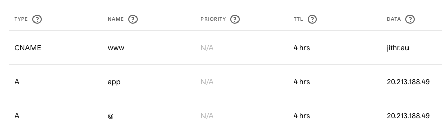
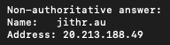

# 05 - DNS Configuration

## Overview

The domain `jithr.au` is used to provide a user-friendly public address for the Azure-hosted Ruby on Rails application.

DNS management is handled through Squarespace DNS.

---

## Current Configuration

The domain is configured with a A records that points directly to the Azure virtual machine's public IP address.



---

## Verification

DNS resolution was verified using:

```bash
nslookup jithr.au
```



The returned IP address matched the public IP address assigned to the Azure virtual machine.

The domain was also tested through a web browser and successfully loaded the deployed Rails application.