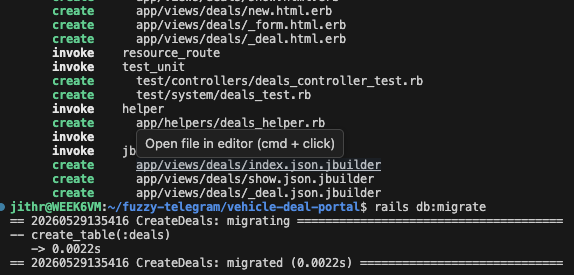
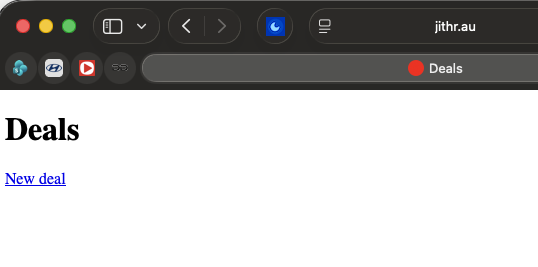
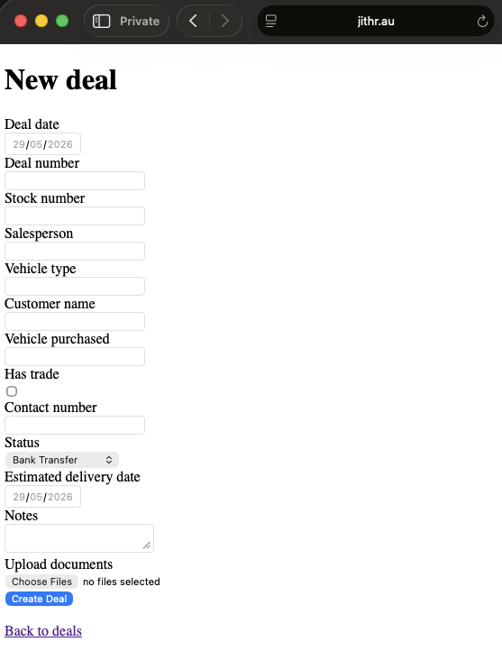
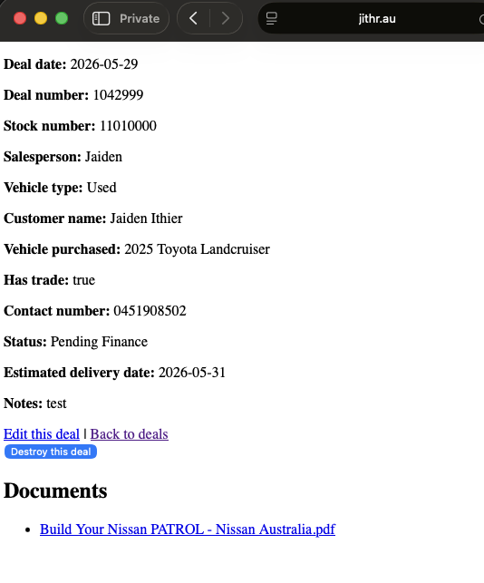
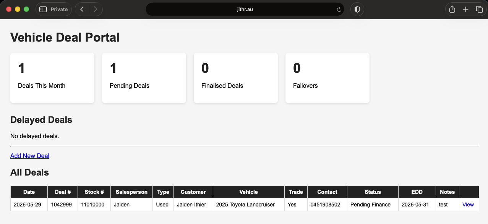
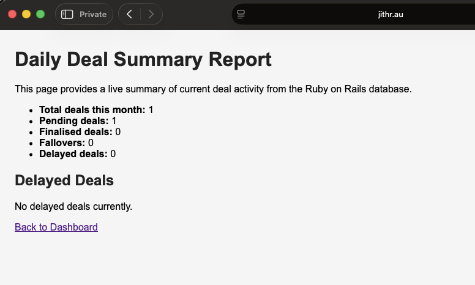

# 07 - Deal Tracking Application and Reporting Script

## Objective

Develop a Ruby on Rails application capable of tracking vehicle sales deals and generating useful reporting information.

The goal of this stage was to move beyond infrastructure configuration and begin implementing practical business functionality.

---

## Deal Data Model

A Deal model was created to represent an individual vehicle sale.

Each deal stores information relevant to tracking a customer's purchase from sale through delivery.

The scaffold was generated using:

```bash
rails generate scaffold Deal deal_date:date deal_number:string stock_number:string salesperson:string vehicle_type:string customer_name:string vehicle_purchased:string has_trade:boolean contact_number:string status:string estimated_delivery_date:date notes:text
```

Database changes were applied using:

```bash
rails db:migrate
```

---

## Deal Information Stored

The application stores the following information for each deal:

| Field | Purpose |
|---------|---------|
| Deal Date | Date vehicle was sold |
| Deal Number | Internal deal identifier |
| Stock Number | Vehicle stock reference |
| Salesperson | Sales consultant responsible |
| Vehicle Type | New, Used or Demonstrator |
| Customer Name | Purchaser name |
| Vehicle Purchased | Vehicle description |
| Trade Vehicle | Indicates whether a trade-in exists |
| Contact Number | Customer phone number |
| Status | Current stage of delivery process |
| Estimated Delivery Date | Planned delivery date |
| Notes | General comments and reminders |

---

## Deal Status Tracking

A predefined set of deal statuses was implemented within the application model.

```ruby
STATUSES = [
  "Bank Transfer",
  "Pending Finance",
  "Finance Approved",
  "Finance Settled",
  "EDD Set",
  "Paper Delivered",
  "Delivered",
  "Paid",
  "Fallover"
]
```

These statuses allow deals to be categorised according to their progress through the delivery process.

---

## Document Storage

Document uploads were enabled using Rails Active Storage.

Active Storage was installed using:

```bash
rails active_storage:install
rails db:migrate
```

Uploaded documents are linked directly to individual deals.

The system currently supports storing:

- Accepted Offer to Purchase
- Driver's Licence
- Deposit Receipt
- Trade Vehicle Photos
- PPSR Reports
- Vehicle Valuations
- Registration Documentation

This functionality provides a central location for paperwork associated with each deal.

---

## Dashboard Development

The default Rails homepage was replaced with a custom dashboard.

The dashboard displays:

- Total deals this month
- Pending deals
- Finalised deals
- Fallovers
- Delayed deals

The dashboard also displays a complete table of all recorded deals.

---

## Delayed Deal Detection

A custom Ruby method was developed to automatically identify delayed deals.

A deal is considered delayed when:

- The deal remains in a pending status
- The deal date is more than seven days old

Implementation:

```ruby
def delayed?
  pending? && deal_date.present? && deal_date < 7.days.ago.to_date
end
```

This allows management attention to be directed toward deals that may require follow-up.

---

## Reporting Script

A reporting function was developed within the application.

The report is accessible through:

```text
/deal_summary
```

The report calculates live statistics from the database including:

- Total deals this month
- Pending deals
- Finalised deals
- Fallovers
- Delayed deals

This functionality demonstrates the use of Ruby to process stored business data and generate useful operational information.

---

## Application Structure

The following major components were developed during this stage:

| Component | Purpose |
|-----------|---------|
| Deal Model | Stores deal information |
| Deals Controller | Handles deal management |
| Active Storage | Handles document uploads |
| Dashboard View | Displays key statistics |
| Reports Controller | Generates summary reporting |
| Deal Summary Report | Provides management overview |

---

## Verification

Testing confirmed that:

- Deals can be created
- Deals can be edited
- Deals can be deleted
- Documents can be uploaded
- Statuses can be updated
- Dashboard statistics update automatically
- Delayed deals are detected correctly
- Reporting page generates live data from the database

---

## Screenshots








---

## Future Improvements

Future development may include:

- User authentication
- Multi-user support
- Role-based permissions
- Automated document generation
- PDF deal pack creation
- Customer communication tracking
- Vehicle inventory integration
- Deal delivery workflow automation